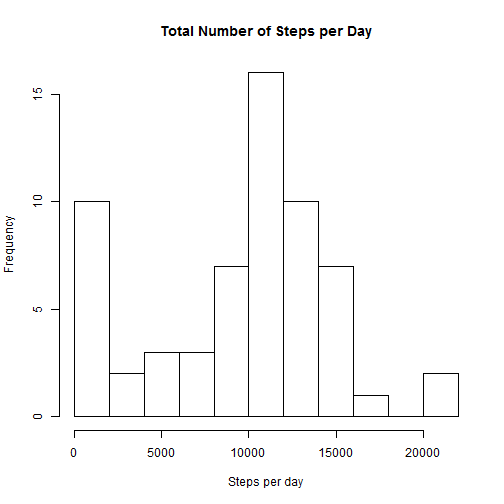
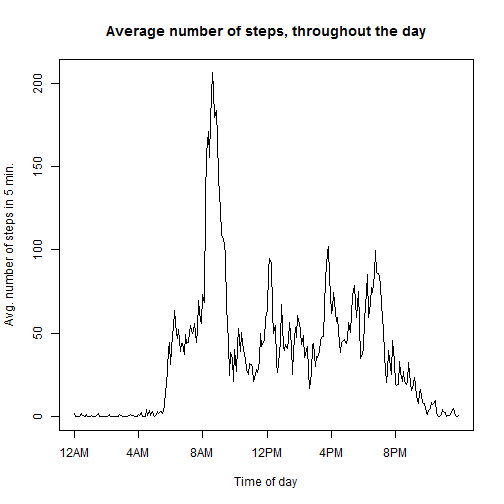
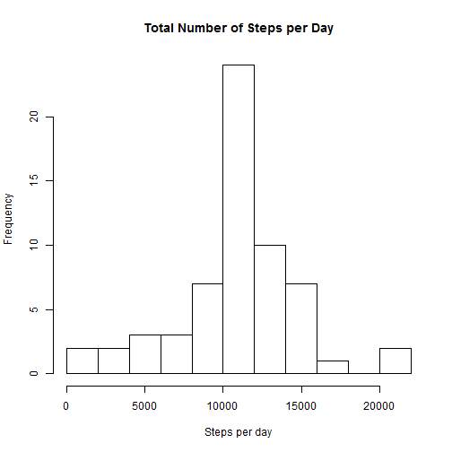
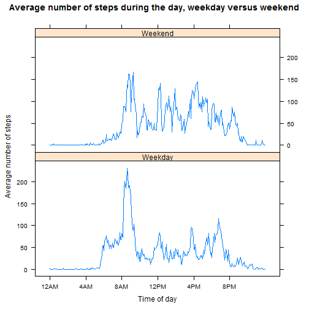

# Peer Assessment 1

## Introduction

Hello! This knitted markdown file shows my analysis for the "number of steps" data provided as part of Module 5, Peer Assessment 1 of the Johns Hopkins University Coursera program on Data Science.

The data file has been unzipped into a CSV file and placed in my working directory. From there, I will construct the graphs, summaries, and new data structures requested in the assignment.

## Loading and preprocessing the data

I've read in the data with the simple call


```r
data <- read.csv("activity.csv")
```

I won't do any fancy processing *yet*, because we can get pretty far in the assignment without transforming any of the variables.

## What is mean total number of steps taken per day?

In the code below, I've used the `tapply` function to get the total number of steps the subject walked on each of the 61 days of the study (Oct 1, 2012 - Nov 30, 2012).


```r
steps.per.day <- tapply(data$steps,data$date,sum,na.rm=T)
hist(steps.per.day,breaks=10,
     main="Total Number of Steps per Day",
     xlab="Steps per day")
```

 

```r
summary(steps.per.day)
```

```
##    Min. 1st Qu.  Median    Mean 3rd Qu.    Max. 
##       0    6778   10400    9354   12810   21190
```

As you can see from the histogram, there are some days for which data were not available (hence the appearance of 0 steps). The **mean** number of steps per day was **9354**, and the **median** number of steps per day was **10,400**.

## What is the average daily activity pattern?

I'll start by using `tapply` again, but this time aggregating
by time interval and determining the average rather than the sum.


```r
steps.per.interval <- tapply(data$steps,data$interval,mean,na.rm=T)
```

To make a time series plot, there's an issue with the x-axis. Specifically, it's tempting to use the interval codes from the original data file, but this will distort the axis inappropriately. Why? Because, for example, "155" is followed by "200": 1:55AM is indeed followed by 2:00AM, but these are 5 minutes apart, not 45. There's a danger in treating the interval variable as a quantitative x-variable.

Instead, I worked out some time points (12AM, 4AM, etc.) and their corresponding positions in the time series. The result is a much nicer-looking x-axis.


```r
plot(steps.per.interval, type="l", xaxt="n",
     xlab = "Time of day",
     ylab = "Avg. number of steps in 5 min.",
     main = "Average number of steps, throughout the day")
axis(1,at=c(1,49,97,145,193,241),
     labels=c("12AM","4AM","8AM","12PM","4PM","8PM"))
```

 

To find that peak, just use

```r
which(steps.per.interval==max(steps.per.interval))
```

```
## 835 
## 104
```
The 5-minute interval with the highest average number of steps, aka the peak in the time series plot, corresponds to **8:35AM-8:40AM**.

## Imputing missing values


```r
missing <- which(is.na(data$steps))
num_na <- length(missing)
```

To begin, there are 2304 NA values (pulled from `num_na`, above).

We're given the choice of imputing by day effects or by time-of-day effects.  Given what the preceding time series shows (a strong, though not unexpected, time-of-day effect), I've chosen the latter.

The time-of-day means are already stored in `steps.per.interval`. The tricky part is placing the imputed values correctly. To that end, I've used the modular artihmetic function `%%` to wrap the indices around appropriately. (One tiny modification is required, since I want indices within a day to run from 1 to 288, not 1 to 287 and then back to 0.)


```r
imp.steps <- data$steps
for (i in missing){
     j = i %% 288
     if (j==0){
          j <- 288
     }
     imp.steps[i] <- steps.per.interval[j]
}

imp.data <- data.frame(imp.steps,data$date,data$interval)
colnames(imp.data) <- c("steps","date","interval")
```

The result of the above code is a new data frame, `imp.data`, with the previous NA values replaced by imputed values.

Now, let's see what we've created!


```r
imp.steps.per.day <- tapply(imp.data$steps,imp.data$date,sum,na.rm=T)
hist(imp.steps.per.day,breaks=10,
     main="Total Number of Steps per Day",
     xlab="Steps per day")
```

 

```r
summary(imp.steps.per.day)
```

```
##    Min. 1st Qu.  Median    Mean 3rd Qu.    Max. 
##      41    9819   10770   10770   12810   21190
```
The mean and median total number of steps per day are now both 
**10,770**.  That's higher than the original mean and median.

## Are there differences in activity patterns between weekdays and weekends?

Finally, we want parallel time series of the average number of steps throughout the day, separated into weekdays and weekends. That means we need to create an indicator variable for weekdays and weekends.


```r
imp.data$day <- weekdays(strptime(imp.data$date, format="%Y-%m-%d"))
imp.data$daytype <- rep("Weekday",dim(imp.data)[1])
imp.data$daytype[imp.data$day %in% c("Saturday","Sunday")] <- "Weekend"
```

In the code above, `strptime` converts the date character string into a calendar date readable by R. The `weekdays` function outside it converts calendar days to days of the week (Monday, Tuesday, etc.).

The last two lines append to my data frame an indicator variable for whether each day is a weekday or weekend. (I didn't really have to append the first line of code to the data frame, but what the heck.)

Okay, now I want the average number steps for each time interval separately for weedays and weekends (what I've called `daytype`).
The best way I know to get means across two factors is the `aggregate` command, as seen below.


```r
ts.split <- aggregate(steps ~ interval + daytype,
                      data = imp.data, FUN=mean)
```

I called my output object `ts.split` because, in my mind, it's a split time series.

Personally, I think an overlaid time series plot would be optimal. But, the assignment specifically demands a panel plot, so that's what I've done.


```r
library(lattice)

ts.split$time.index <- rep(1:288,2) # Needed for correct time series

xyplot(steps ~ time.index  | daytype, data = ts.split,
       type="l", layout = c(1,2),
       xlab = "Time of day",
       ylab = "Average number of steps",
       main = "Average number of steps during the day, weekday versus weekend",
       scales = list(x = list(at=c(1,49,97,145,193,241),
                              labels=c("12AM","4AM","8AM","12PM","4PM","8PM"))))
```

 
